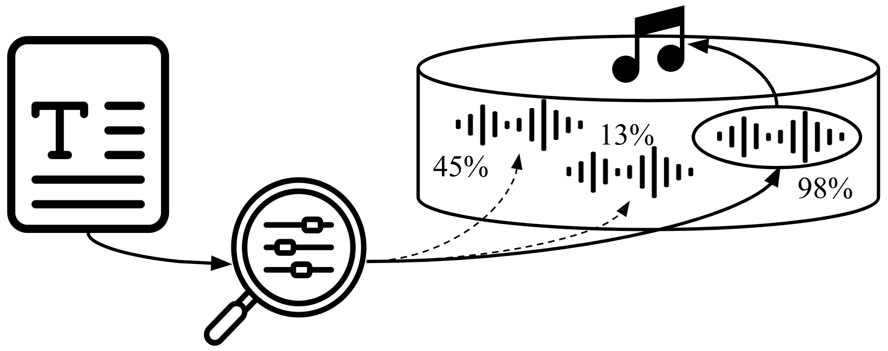

<div  align="center">

# Contrastive Audio-Language Learning for Music
[Ilaria Manco](https://ilariamanco.com/)<sup>1,2</sup>,
[Emmanouil Benetos](http://www.eecs.qmul.ac.uk/~emmanouilb/)<sup>1</sup>,
[Elio Quinton](https://scholar.google.com/citations?user=IaciybgAAAAJ)<sup>2</sup>,
[Gyorgy Fazekas](http://www.eecs.qmul.ac.uk/~gyorgyf/about.html)<sup>1</sup> <br>
<sup>1</sup>  Queen Mary University of London, <sup>2</sup>  Universal Music Group

[](https://www.gnu.org/licenses/gpl-3.0)
[](https://arxiv.org/abs/2208.12208)

<p align="center">

</p align="center">
</div>

This repository is the official implementation of [*Contrastive Audio-Language Learning for Music*](https://arxiv.org/abs/2208.12208), accepted to [ISMIR 2022](https://ismir2022.ismir.net/).

In this work we introduced **MusCALL**, a framework for Contrastive Audio-Language Learning in the music domain. Our approach consists of a dual-encoder architecture that learns the alignment between pairs of music audio and descriptive sentences, producing multimodal embeddings that can be used for text-to-audio and audio-to-text retrieval out-of-the-box. Thanks to this property, MusCALL can be transferred to virtually any task that can be cast as text-based retrieval in a zero-shot fashion.

We provide code for training and evaluation of MusCALL on audio-text cross-modal retrieval and two zero-shot classification tasks (auto-tagging and genre classification).

## Setup
Create a fresh virtual environment:

```setup
python -m venv venv 
source venv/bin/activate
```

Then, clone the repository and install the dependencies:

```setup
git clone https://www.github.com/ilaria-manco/muscall 
cd muscall 
pip install -r requirements.txt
pip install -e .
```

## Preparing the dataset
MusCALL is trained on a multimodal dataset of (audio, text) pairs. 

Annotations should be provided in JSON format and must include the following fields:

```audio_id```:     the unique identifier for each audio track in the dataset

```caption``` :     a string with the textual description of the audio track 

```audio_path```:   path to the audio track, relative to the root audio directory

One JSON file per split must be provided and stored in the [`data/datasets`](data/datasets/) directory, following this structure:

```
dataset_name
├── audio            
│   ├── track_1.npy
│   ├── track_2.npy
|   └── ...
├── dataset_train.json    
├── dataset_val.json    
└── dataset_test.json
```

An illustrative example of the dataset is provided in [`data/datasets/audiocaption/`](data/datasets/audiocaption/).

## Training MusCALL
Dataset, model and training configurations are set in the respective `yaml` files in [`configs`](configs). You can also pass some options via the CLI, overwriting the arguments in the config files. For more details on the CLI options, please refer to the [training script](scripts/train.py).

To train the model with the default configs, simply run

```bash
cd scripts/
python train.py 
```

This will generate a `model_id` and create a new folder in [`save/experiments/`](save/experiments/) where the output will be saved.

If you wish to resume training from a saved checkpoint, run this command:

```bash
python train.py --experiment_id <model_id> 
```

## Evaluating MusCALL
Once trained, you can evaluate MusCALL on the cross-modal retrieval task:

```bash
python evaluate.py <model_id> retrieval
```

or, in the zero-shot transfer setting, on an arbitrary music classification task.

In our zero-shot evaluation, we include:

* `mtt`: auto-tagging on the [MagnaTagATune Dataset](https://mirg.city.ac.uk/codeapps/the-magnatagatune-dataset)
* `gtzan`: music genre classification on the [GTZAN dataset](http://marsyas.info/downloads/datasets.html)

```bash
python evaluate.py <model_id> zeroshot <dataset_name>
```

You'll need to download the datasets inside the [`datasets/`](datasets/) folder and preprocess them before running the zeroshot evaluation.


## Cite
If you use the code in this repo, please consider citing our work:

```bib
@inproceedings{manco2022,
  title={Contrastive Audio-Language Learning for Music}, 
  author={Manco, Ilaria and Benetos, Emmanouil and Quinton, Elio and Fazekas, György},
  booktitle={Proceedings of the 23rd International Society for Music Information Retrieval Conference (ISMIR)}, 
  year={2022},
}
```

## License
This repository is released under the GNU General Public License v3.0 license. Please see the [LICENSE](LICENSE) file for more details.

Some of the code is adapted from the following repos: 
* [CLIP](https://github.com/openai/CLIP/) by [@openai](https://github.com/openai/)
* [x-clip](https://github.com/lucidrains/x-clip/) by [@lucidrains](https://github.com/lucidrains/)

## Contact
If you have any questions, please get in touch: [i.manco@qmul.ac.uk](i.manco@qmul.ac.uk).
